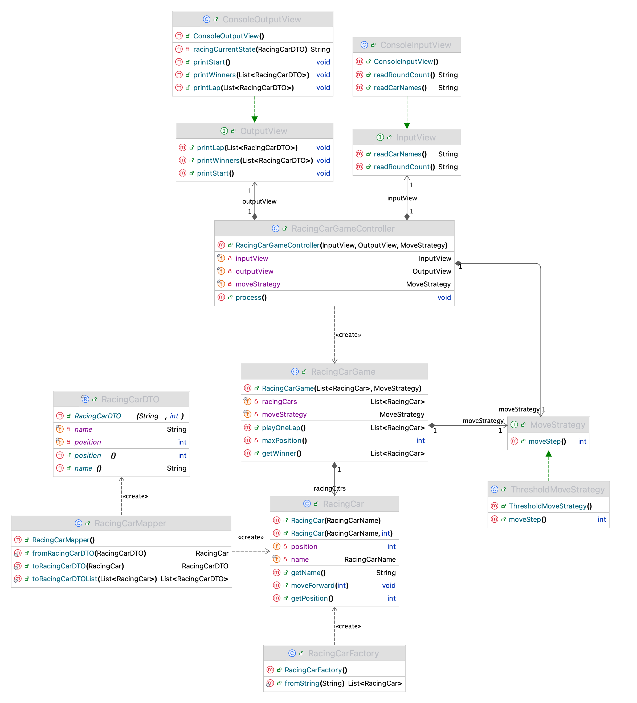

# java-racingcar-precourse
## 기능 요구사항
초간단 자동차 경주 게임을 구현한다. 다음과 같은 요구사항을 만족해야한다.
- 사용자는 몇 번의 이동을 할 것인지를 입력할 수 있어야 한다.
- 주어진 횟수 동안 n대의 자동차는 전진 또는 멈출 수 있으며 0에서 9 사이의 난수 중 4 이상일 경우 전진한다.
- 각 자동차에 이름을 부여할 수 있다. 전진하는 자동차를 출력할 때 자동차 이름을 같이 출력한다.
- 자동차 이름은 쉼표(,)를 기준으로 구분하며 이름은 5자 이하만 가능하다.
- 자동차 경주 게임을 완료한 후 누가 우승했는지를 알려준다. 우승자는 한 명 이상일 수 있으며 우승자가 여러 명일 경우 쉼표(,)를 이용하여 구분한다.
<br/>

### 구현 할 기능 목록
- [x] 경주해야 할 자동차의 대수 및 이름을 입력받는 기능 (InputCarNames)
- [x] 전진하는 조건을 확인하고 자동차를 이동하는 기능 (MoveCar)
- [x] 사용자의 이동 횟수를 이동받는 횟수 (InputRounds)
- [x] 각 전진 횟수에 맞게 출력하는 기능 (PrintRacing)
- [x] 우승자를 판별하는 기능 (ResultWinner)
- [x] 공동 우승자가 있는 경우 이를 모두 구분하여 출력하는 기능 (PrintWinner)
<br/>


## 프로젝트 구조
```angular2html
📦 main
└── 📂 java
    └── 📂 racingcar
        ├── 📂 controller
        │   └── RacingCarGameController.java
        │
        ├── 📂 domain
        │   ├── RacingCar.java 
        │   ├── RacingCarName.java           
        │   ├── RacingCarFactory.java       
        │   ├── RacingCarGame.java          
        │   ├── RoundCount.java           
        │   └── 📂 move
        │       ├── MoveStrategy.java         
        │       └── ThresholdMoveStrategy.java
        │
        ├── 📂 dto
        │   └── RacingCarDTO.java          
        │
        ├── 📂 mapper
        │   └── RacingCarMapper.java         
        │
        ├── 📂 view
        │   ├── InputView.java              
        │   ├── OutputView.java               
        │   ├── ConsoleInputView.java         
        │   └── ConsoleOutputView.java     
        │
        └── Application.java
```
<br/>

## 각 클래스의 역할
| 클래스 | 역할 |
|--------|------|
| **Application** | 프로그램 시작점 (`main`) |
| **RacingCarGameController** | 전체 게임 흐름 제어 (입력 → 실행 → 출력) |
| **RacingCarFactory** | 사용자 입력 문자열을 자동차 객체로 변환 |
| **RacingCar** | 자동차 객체, 이동 상태 관리 |
| **RacingCarName** | 이름 유효성 검사 (공백 / 길이) |
| **RoundCount** | 시도 횟수 유효성 검사 |
| **RacingCarGame** | 한 라운드 실행, 우승자 계산 |
| **MoveStrategy** | 이동 조건 추상화 인터페이스 |
| **ThresholdMoveStrategy** | 0~9 랜덤 숫자 기반 이동 결정 |
| **RacingCarDTO / RacingCarMapper** | 도메인 데이터를 출력용으로 매핑 |
| **InputView / OutputView** | 입출력 추상화 계층 |
| **ConsoleInputView / ConsoleOutputView** | 콘솔 기반 입출력 구현체 |
<br/>

## 주요 클래스 다이어그램
